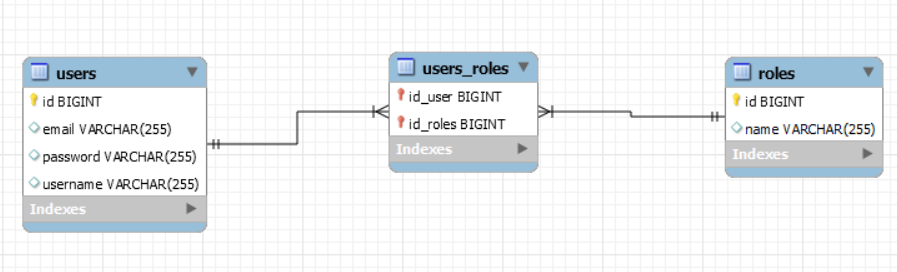

# Spring boot Security y JWT

Uso de Spring boot Security y Json Web Token, autenticacion de usuarios, acceso a endpoint especifcicos
mediante los permisos y roles que se le asignen a cada usuario.

## Diagrama DER

## Coleccion de postman
